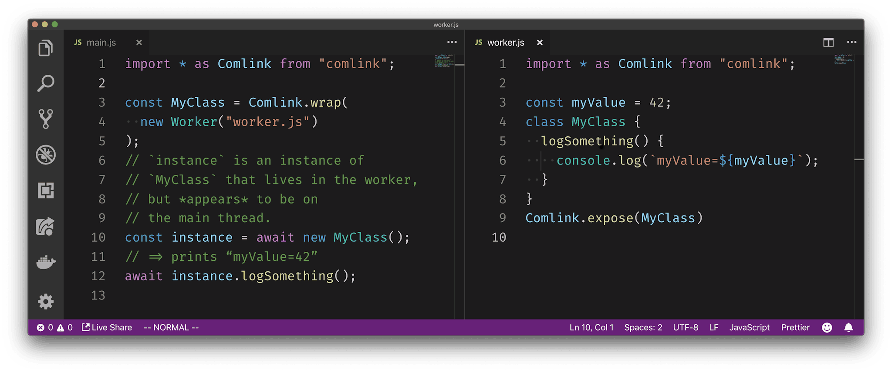

# <!--fit--> ⚙️ Web Workers

### <!--fit--> Multi-threading in JavaScript

---


## Prerequisites

- JavaScript is a single-threaded language with asynchronous capabilities
- Workers are scripts that run in a separate thread
- Web Workers are a part of the [Living Standard](https://html.spec.whatwg.org/multipage/workers.html#workers)
- They are widely supported
- ... and they have existed for quite a while, but they are not used very often by developers

---

## Benefits of Workers

Running computationally intensive code in a web worker can help you prevent a laggy or completely unresponsive user experience


---

## Communication


---

## API


```js
// worker.js ⚙️
self.onmessage((event) => {
  if (event.data === "foo") {
    self.postMessage("bar");
  }
});
```

```js
// main.js
const worker = new Worker("./worker.js");

worker.onmessage = (event) => {
  console.assert(event.data === "bar");
};

worker.postMessage("foo");
```

---

# Limitations

Since workers run seperately from the main thread, they do not have access to —

- `DOM`
- `window`
- `document`
- `parent`

---

# What can you do?

- Pure JavaScript
- Make `fetch` calls
- Spawn other Web Workers
- Import & use libraries

— most things that do not make use of non thread-safe features

---

# Use Cases

- 🎛 State Management
- 👾 Video-game logic
- 🗂 Processing of large files
- 🧮 Expensive calculations

---


# [Demo](http://localhost:1234)

fbosch/webworker-example

---


# Why is it underused?

### ... probably the API 😕

---

# Downsides

- All communication happens through messages, which can be disadvantagous if your logic requires more complexity
- Stringification of objects and other arguments
- Lots of boilerplate and abstractions

---


# ✨ Introducing Comlink ✨

> Comlink makes WebWorkers enjoyable. Comlink is a tiny library (1.1kB), that removes the mental barrier of thinking about postMessage and hides the fact that you are working with workers.

---




---

# <!--fit--> ❓

---

# Thank You.
